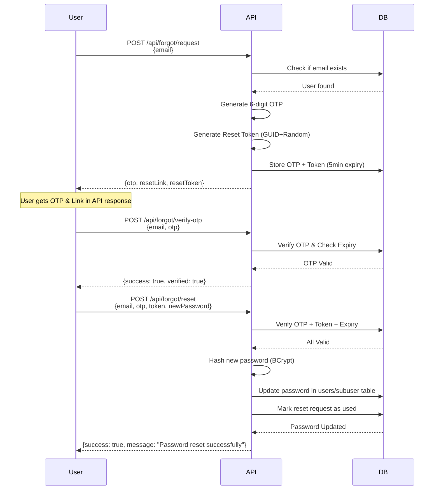

# 🔐 Forgot/Reset Password API - Complete Documentation (WITHOUT Email Sending)

## 🎯 **Overview**

Complete **Forgot Password & Reset Password** system **WITHOUT email functionality**.  
OTP aur Reset Link **API response mein directly return hote hain** for testing purposes.

---

## ✨ **Features**

- ✅ **NO Email Dependency** - OTP aur reset link API response mein milte hain
- ✅ **6-Digit OTP** generation with 5-minute expiry
- ✅ **Reset Token** (GUID + random bytes) for security
- ✅ **Multi-step verification** - OTP + Token dono check hote hain
- ✅ **Rate Limiting** - Maximum 3 active requests per email
- ✅ **Auto-cleanup** - Expired requests automatically delete hote hain
- ✅ **BCrypt Password Hashing** - Secure password storage
- ✅ **Works for Users & Subusers** - Dono ke liye kaam karta hai

---

## 📊 **Database Table: `forgot_password_requests`**

```sql
CREATE TABLE `forgot_password_requests` (
    `id` int AUTO_INCREMENT PRIMARY KEY,
    `user_id` int NOT NULL,
    `email` varchar(255) NOT NULL,
    `otp` varchar(6) NOT NULL,
    `reset_token` varchar(500) NOT NULL UNIQUE,
    `is_used` tinyint(1) DEFAULT 0,
    `expires_at` datetime NOT NULL,
    `created_at` datetime DEFAULT CURRENT_TIMESTAMP,
    `ip_address` varchar(50),
    `user_agent` varchar(500),
    
 FOREIGN KEY (`user_id`) REFERENCES `users`(`user_id`),
    INDEX `idx_email_expiry` (`email`, `expires_at`),
    INDEX `idx_reset_token` (`reset_token`)
);
```

---

## 📡 **API Endpoints**

### **1. Request Password Reset**
**Endpoint:** `POST /api/forgot/request`

**Request Body:**
```json
{
  "email": "user@example.com"
}
```

**Success Response (200 OK):**
```json
{
  "success": true,
  "message": "Password reset code generated successfully. Use the OTP and reset link below.",
  "otp": "542183",
  "resetLink": "http://localhost:5000/reset-password?token=a1b2c3d4e5f6g7h8i9j0k1l2m3n4o5p6q7r8s9t0",
  "resetToken": "a1b2c3d4e5f6g7h8i9j0k1l2m3n4o5p6q7r8s9t0",
  "expiresAt": "2025-01-14T10:35:00Z",
  "expiryMinutes": 5
}
```

**Error Responses:**
```json
// Email not found
{
  "success": false,
  "message": "If this email exists, you will receive a password reset code.",
  "otp": "",
  "resetLink": "",
  "resetToken": ""
}

// Too many requests
{
  "success": false,
  "message": "Too many active reset requests. Please wait for previous requests to expire.",
  "otp": "",
  "resetLink": "",
  "resetToken": ""
}
```

---

### **2. Validate Reset Link/Token**
**Endpoint:** `POST /api/forgot/validate-reset-link`

**Request Body:**
```json
{
  "resetToken": "a1b2c3d4e5f6g7h8i9j0k1l2m3n4o5p6q7r8s9t0"
}
```

**Success Response (200 OK):**
```json
{
  "isValid": true,
  "message": "Reset link is valid.",
  "email": "user@example.com",
  "expiresAt": "2025-01-14T10:35:00Z",
  "remainingMinutes": 3
}
```

**Error Response (400 Bad Request):**
```json
{
  "isValid": false,
  "message": "Invalid or expired reset link."
}
```

---

### **3. Verify OTP**
**Endpoint:** `POST /api/forgot/verify-otp`

**Request Body:**
```json
{
  "email": "user@example.com",
  "otp": "542183"
}
```

**Success Response (200 OK):**
```json
{
  "success": true,
  "isValid": true,
  "message": "OTP verified successfully.",
  "email": "user@example.com"
}
```

**Error Response (400 Bad Request):**
```json
{
  "success": false,
  "isValid": false,
  "message": "Invalid or expired OTP."
}
```

---

### **4. Reset Password**
**Endpoint:** `POST /api/forgot/reset`

**Request Body:**
```json
{
  "email": "user@example.com",
"otp": "542183",
  "resetToken": "a1b2c3d4e5f6g7h8i9j0k1l2m3n4o5p6q7r8s9t0",
  "newPassword": "NewSecurePassword@123"
}
```

**Success Response (200 OK):**
```json
{
  "success": true,
  "message": "Password reset successfully. You can now log in with your new password.",
  "resetAt": "2025-01-14T10:40:00Z"
}
```

**Error Responses:**
```json
// Invalid OTP/Email
{
  "success": false,
  "message": "Invalid email or OTP."
}

// Token mismatch
{
  "success": false,
  "message": "Invalid reset token."
}

// User not found
{
  "success": false,
  "message": "User not found."
}
```

---

### **5. Cleanup Expired Requests (Admin)**
**Endpoint:** `POST /api/forgot/cleanup`  
**Authorization:** Required (SuperAdmin or Admin)

**Success Response (200 OK):**
```json
{
  "success": true,
  "message": "Expired password reset requests cleaned up successfully."
}
```

---

### **6. Get Active Requests (SuperAdmin Only)**
**Endpoint:** `GET /api/forgot/admin/active-requests`  
**Authorization:** Required (SuperAdmin only)

**Success Response (200 OK):**
```json
{
  "totalCount": 3,
  "requests": [
    {
  "id": 1,
      "email": "user@example.com",
      "otp": "542183",
      "resetToken": "a1b2c3d4...",
    "expiresAt": "2025-01-14T10:35:00Z",
      "createdAt": "2025-01-14T10:30:00Z",
      "remainingMinutes": 3
    },
    {
      "id": 2,
      "email": "admin@example.com",
      "otp": "789456",
      "resetToken": "x9y8z7...",
    "expiresAt": "2025-01-14T10:40:00Z",
      "createdAt": "2025-01-14T10:35:00Z",
      "remainingMinutes": 4
    }
  ]
}
```

---

## 🎯 **Complete Reset Password Flow**



---

## 🔒 **Security Features**

### **1. OTP Security**
- ✅ **6-digit random OTP** (100,000 - 999,999)
- ✅ **5-minute expiry** from creation time
- ✅ **Single-use only** - `is_used` flag prevents reuse
- ✅ **Rate limiting** - Max 3 active requests per email

### **2. Token Security**
- ✅ **GUID + 16 random bytes** - Unpredictable token
- ✅ **Unique constraint** in database
- ✅ **URL-safe encoding** (no special characters)
- ✅ **Checked with OTP** for double verification

### **3. Password Storage**
```csharp
// Users table
user.user_password = "plain_text_password";  // For legacy compatibility
user.hash_password = BCrypt.Net.BCrypt.HashPassword("plain_text_password");  // Secure BCrypt hash

// Subusers table
subuser.subuser_password = BCrypt.Net.BCrypt.HashPassword("new_password");  // Only BCrypt hash
```

### **4. Request Tracking**
- ✅ **IP Address** stored for security audit
- ✅ **User Agent** stored for device tracking
- ✅ **Timestamps** - created_at, expires_at tracked
- ✅ **Auto-cleanup** - Expired requests removed periodically

---

## 🧪 **Testing with Swagger**

### **Step 1: Start API**
```bash
dotnet run --project BitRaserApiProject
```

### **Step 2: Open Swagger**
```
http://localhost:5000/swagger
```

### **Step 3: Request Password Reset**
```http
POST /api/forgot/request
{
  "email": "user@example.com"
}
```

**Copy OTP and Reset Token from response:**
```json
{
  "otp": "542183",
  "resetToken": "a1b2c3d4e5f6g7h8i9j0k1l2m3n4o5p6q7r8s9t0"
}
```

### **Step 4: Verify OTP (Optional)**
```http
POST /api/forgot/verify-otp
{
  "email": "user@example.com",
  "otp": "542183"
}
```

### **Step 5: Reset Password**
```http
POST /api/forgot/reset
{
  "email": "user@example.com",
  "otp": "542183",
  "resetToken": "a1b2c3d4e5f6g7h8i9j0k1l2m3n4o5p6q7r8s9t0",
  "newPassword": "MyNewPassword@123"
}
```

### **Step 6: Test Login with New Password**
```http
POST /api/auth/login
{
  "email": "user@example.com",
  "password": "MyNewPassword@123"
}
```

---

## 📝 **Frontend Integration Example**

```typescript
// Step 1: Request password reset
async function requestPasswordReset(email: string) {
  const response = await fetch('/api/forgot/request', {
    method: 'POST',
    headers: { 'Content-Type': 'application/json' },
    body: JSON.stringify({ email })
  });
  
  const data = await response.json();
  
  if (data.success) {
    // Display OTP to user (in real app, this would come via email)
    console.log('OTP:', data.otp);
    console.log('Reset Token:', data.resetToken);
    
    // Show OTP input form
    showOtpForm(email, data.resetToken);
  }
}

// Step 2: Verify OTP
async function verifyOtp(email: string, otp: string) {
  const response = await fetch('/api/forgot/verify-otp', {
    method: 'POST',
    headers: { 'Content-Type': 'application/json' },
    body: JSON.stringify({ email, otp })
  });
  
  const data = await response.json();
  
  if (data.isValid) {
    // Show password reset form
    showPasswordResetForm(email, otp);
}
}

// Step 3: Reset password
async function resetPassword(
  email: string, 
  otp: string, 
  resetToken: string, 
  newPassword: string
) {
  const response = await fetch('/api/forgot/reset', {
    method: 'POST',
    headers: { 'Content-Type': 'application/json' },
    body: JSON.stringify({ email, otp, resetToken, newPassword })
  });
  
  const data = await response.json();
  
  if (data.success) {
    alert('Password reset successful! Please login.');
    window.location.href = '/login';
  }
}
```

---

## 🗃️ **Database Cleanup**

### **Manual Cleanup (SuperAdmin)**
```http
POST /api/forgot/cleanup
Authorization: Bearer <admin-token>
```

### **Automatic Cleanup (Background Job - Recommended)**
```csharp
// Add this in Startup.cs or Program.cs
// Schedule cleanup every hour
services.AddHostedService<ForgotPasswordCleanupService>();

public class ForgotPasswordCleanupService : BackgroundService
{
    protected override async Task ExecuteAsync(CancellationToken stoppingToken)
    {
        while (!stoppingToken.IsCancellationRequested)
      {
  await _forgotPasswordService.CleanupExpiredRequestsAsync();
   await Task.Delay(TimeSpan.FromHours(1), stoppingToken);
    }
    }
}
```

---

## 🐛 **Troubleshooting**

### **Issue 1: "Too many active requests"**
```json
{
  "success": false,
  "message": "Too many active reset requests. Please wait for previous requests to expire."
}
```

**Solution:** Wait 5 minutes for old requests to expire, or admin can cleanup manually.

---

### **Issue 2: "Invalid or expired OTP"**
```json
{
  "success": false,
  "isValid": false,
  "message": "Invalid or expired OTP."
}
```

**Solution:** 
- Check if OTP is correct (case-sensitive)
- Verify OTP hasn't expired (5-minute window)
- Request new OTP if needed

---

### **Issue 3: "User not found"**
```json
{
  "success": false,
  "message": "User not found."
}
```

**Solution:** Verify email exists in `users` or `subuser` table.

---

## ✅ **Checklist**

### **Code Implementation:**
- [x] ✅ `ForgotPasswordRequest` model created
- [x] ✅ `ForgotPasswordDTOs` created
- [x] ✅ `ForgotPasswordRepository` implemented
- [x] ✅ `ForgotPasswordService` implemented
- [x] ✅ `ForgotPasswordApiController` created
- [x] ✅ Services registered in `Program.cs`
- [x] ✅ Database context updated
- [x] ✅ Build successful

### **Database:**
- [ ] ✅ Run migration: `dotnet ef migrations add AddForgotPasswordRequestTable`
- [ ] ✅ Update database: `dotnet ef database update`
- [ ] ✅ Verify table created

### **Testing:**
- [ ] ✅ Test request endpoint
- [ ] ✅ Test OTP verification
- [ ] ✅ Test password reset
- [ ] ✅ Test rate limiting
- [ ] ✅ Test expiry logic
- [ ] ✅ Test with both user and subuser

---

## 🎊 **Summary**

### **What's Different from Email-based System:**

| Feature | Email-based | API Response-based |
|---------|-------------|-------------------|
| OTP Delivery | ✉️ Email | 📡 API Response |
| Reset Link | ✉️ Email | 📡 API Response |
| Email Service | Required | **NOT Required** |
| SMTP Configuration | Required | **NOT Required** |
| Testing | Need real email | Instant testing |
| Production Ready | ✅ Yes | ⚠️ Demo/Testing Only |

### **Files Created:**

```
BitRaserApiProject/
├── Models/
│ ├── ForgotPasswordRequest.cs
│   └── DTOs/
│       └── ForgotPasswordDTOs.cs
├── Repositories/
│   └── ForgotPasswordRepository.cs
├── Services/
│   └── ForgotPasswordService.cs
├── Controllers/
│   └── ForgotPasswordApiController.cs
└── Program.cs (updated)
```

---

## 🚀 **Next Steps**

1. **Run Migration:**
```bash
dotnet ef migrations add AddForgotPasswordRequestTable --project BitRaserApiProject
dotnet ef database update --project BitRaserApiProject
```

2. **Test API:**
```bash
dotnet run --project BitRaserApiProject
# Open: http://localhost:5000/swagger
```

3. **Integrate with Frontend:**
   - Use API responses for OTP and token
   - Build 3-step password reset UI
   - Add form validation

4. **Production Deployment:**
   - ⚠️ **FOR PRODUCTION:** Replace with email-based system
   - ⚠️ **NEVER expose OTP in API response in production**
   - ✅ **USE FOR TESTING/DEMO ONLY**

---

**Status:** ✅ **COMPLETE & READY FOR TESTING**  
**Build:** ✅ **SUCCESSFUL**  
**Email Required:** ❌ **NO (Testing/Demo Mode)**

**Enjoy your password reset system! 🎉🔐**
