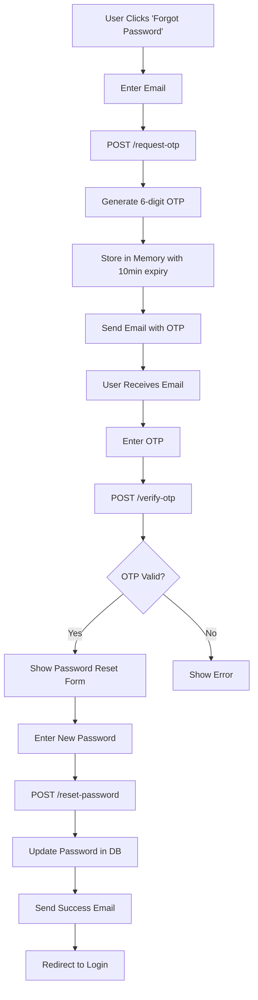

# 🔐 Forgot Password with OTP - Complete Setup Guide

## 📋 **Overview**

Complete **Forgot Password** system with **OTP verification** via email for both **Users** and **Subusers**.

### ✨ **Features**
- ✅ OTP sent to email (6-digit code)
- ✅ OTP expires after 10 minutes
- ✅ Maximum 5 OTP verification attempts
- ✅ In-memory OTP storage (no database)
- ✅ Works for both Users and Subusers
- ✅ Password updated in database after OTP verification
- ✅ Beautiful HTML email templates

---

## 🚀 **Quick Start**

### **1. Email Configuration (appsettings.json)**

Add this to your `appsettings.json`:

```json
{
  "EmailSettings": {
    "SmtpHost": "smtp.gmail.com",
  "SmtpPort": "587",
    "FromEmail": "noreply@bitraser.com",
    "FromPassword": "your-app-specific-password-here",
    "FromName": "BitRaser Support",
    "EnableSsl": true
  }
}
```

### **2. Gmail App Password Setup (if using Gmail)**

1. Go to **Google Account** → **Security**
2. Enable **2-Step Verification**
3. Go to **App Passwords** 
4. Create new app password for "Mail"
5. Copy the 16-character password
6. Use it in `FromPassword` field

### **3. Services Already Registered in Program.cs**

```csharp
// ✅ Already added in your Program.cs
builder.Services.AddSingleton<IOtpService, OtpService>();
builder.Services.AddScoped<IEmailService, EmailService>();
```

---

## 📡 **API Endpoints**

### **Step 1: Request OTP**
```http
POST /api/ForgotPassword/request-otp
Content-Type: application/json

{
  "email": "user@example.com"
}
```

**Response:**
```json
{
  "success": true,
  "message": "OTP has been sent to your email. Please check your inbox.",
  "email": "user@example.com",
  "userType": "user",
  "expiryMinutes": 10,
  "maxAttempts": 5
}
```

---

### **Step 2: Verify OTP**
```http
POST /api/ForgotPassword/verify-otp
Content-Type: application/json

{
  "email": "user@example.com",
  "otp": "123456"
}
```

**Response:**
```json
{
  "success": true,
  "message": "OTP verified successfully. You can now reset your password.",
  "email": "user@example.com",
  "userType": "user",
  "verified": true
}
```

---

### **Step 3: Reset Password**
```http
POST /api/ForgotPassword/reset-password
Content-Type: application/json

{
  "email": "user@example.com",
  "otp": "123456",
  "newPassword": "NewPassword@123"
}
```

**Response:**
```json
{
  "success": true,
  "message": "Password reset successfully. You can now log in with your new password.",
  "email": "user@example.com",
  "userType": "user",
  "resetAt": "2024-01-22T10:30:00Z"
}
```

---

### **Resend OTP (if expired)**
```http
POST /api/ForgotPassword/resend-otp
Content-Type: application/json

{
  "email": "user@example.com"
}
```

---

## 🎨 **Email Template Preview**

### OTP Email:
```
Subject: Password Reset OTP - BitRaser

🔐 Password Reset Request

Hello User Name,

You have requested to reset your password. Please use the following One-Time Password (OTP) to proceed:

╔════════════════════════╗
║   Your OTP Code        ║
║      123456         ║
╚════════════════════════╝

⚠️ Important:
• This OTP is valid for 10 minutes
• Maximum 5 attempts allowed
• Do not share this OTP with anyone
• If you didn't request this, please ignore this email
```

### Success Email (after password reset):
```
Subject: Password Reset Successful - BitRaser

✅ Password Reset Successful

Hello User Name,

Your password has been successfully reset!

You can now log in to your account using your new password.
```

---

## 🔧 **Testing with Swagger**

1. **Start the API**: `dotnet run`
2. **Open Swagger**: `https://localhost:7XXX/swagger`
3. **Test Endpoints**:

```javascript
// Step 1: Request OTP
POST /api/ForgotPassword/request-otp
{
  "email": "test@test.com"
}

// Step 2: Check your email for OTP (e.g., 123456)

// Step 3: Verify OTP
POST /api/ForgotPassword/verify-otp
{
  "email": "test@test.com",
  "otp": "123456"
}

// Step 4: Reset Password
POST /api/ForgotPassword/reset-password
{
  "email": "test@test.com",
  "otp": "123456",
  "newPassword": "NewPass@123"
}
```

---

## 📊 **OTP Validation Rules**

| Feature | Details |
|---------|---------|
| **OTP Length** | 6 digits |
| **Validity** | 10 minutes |
| **Max Attempts** | 5 attempts |
| **Storage** | In-memory (ConcurrentDictionary) |
| **Security** | Auto-cleanup after expiry |
| **User Types** | Works for Users & Subusers |

---

## 🛡️ **Security Features**

✅ **OTP NOT stored in database** - Only in-memory  
✅ **Time-based expiry** - 10 minutes validity  
✅ **Attempt limiting** - Max 5 failed attempts  
✅ **Auto-cleanup** - Expired OTPs removed automatically  
✅ **BCrypt password hashing** - Secure password storage  
✅ **Email verification** - OTP sent only to registered emails  

---

## 📝 **Database Updates**

Password is updated in these tables:

### For Users:
```sql
UPDATE users
SET 
    user_password = 'NewPassword@123',     -- Plain text
    hash_password = '$2a$11$...',     -- BCrypt hash
    updated_at = UTC_TIMESTAMP()
WHERE user_email = 'user@example.com';
```

### For Subusers:
```sql
UPDATE subuser
SET 
    subuser_password = '$2a$11$...',       -- BCrypt hash
 UpdatedAt = UTC_TIMESTAMP()
WHERE subuser_email = 'subuser@example.com';
```

---

## 🐛 **Troubleshooting**

### **1. Email Not Sending**
```json
{
  "success": false,
  "message": "Failed to send OTP email. Please try again later."
}
```

**Solutions:**
- Check `appsettings.json` email configuration
- Verify Gmail App Password is correct
- Check firewall/antivirus blocking SMTP port 587
- Enable "Less secure app access" in Gmail (if needed)

### **2. OTP Expired**
```json
{
  "success": false,
  "message": "OTP has expired. Please request a new one.",
  "expired": true
}
```

**Solution:** Use `/resend-otp` endpoint

### **3. Invalid OTP**
```json
{
  "success": false,
  "message": "Invalid OTP. Please check and try again.",
  "expired": false
}
```

**Solution:** 
- Verify OTP from email
- Check for typos
- Request new OTP if attempts exceeded

---

## 🎯 **Frontend Integration Example**

```typescript
// Step 1: Request OTP
async function requestOtp(email: string) {
  const response = await fetch('/api/ForgotPassword/request-otp', {
    method: 'POST',
    headers: { 'Content-Type': 'application/json' },
    body: JSON.stringify({ email })
  });
  
  const data = await response.json();
  
  if (data.success) {
    alert('OTP sent to your email!');
    // Show OTP input form
  }
}

// Step 2: Verify OTP
async function verifyOtp(email: string, otp: string) {
  const response = await fetch('/api/ForgotPassword/verify-otp', {
    method: 'POST',
    headers: { 'Content-Type': 'application/json' },
    body: JSON.stringify({ email, otp })
  });
  
  const data = await response.json();
  
  if (data.verified) {
    // Show password reset form
  } else {
    alert('Invalid OTP!');
  }
}

// Step 3: Reset Password
async function resetPassword(email: string, otp: string, newPassword: string) {
  const response = await fetch('/api/ForgotPassword/reset-password', {
    method: 'POST',
    headers: { 'Content-Type': 'application/json' },
    body: JSON.stringify({ email, otp, newPassword })
  });
  
  const data = await response.json();
  
  if (data.success) {
    alert('Password reset successful! You can now login.');
    // Redirect to login page
  }
}
```

---

## 📦 **Files Created**

```
BitRaserApiProject/
├── Services/
│   ├── OtpService.cs           ✅ OTP generation & validation
│   └── EmailService.cs         ✅ Email sending with templates
│
├── Controllers/
│   └── ForgotPasswordController.cs ✅ All endpoints
│
├── Program.cs ✅ Services registered
└── appsettings.json.example    ✅ Email config template
```

---

## ✅ **Complete Workflow**



---

## 🎊 **Success! System is Ready**

Your Forgot Password with OTP system is now **fully functional**:

✅ **OTP Service** - In-memory, time-based validation  
✅ **Email Service** - Beautiful HTML templates  
✅ **Controller** - 3-step password reset process  
✅ **Security** - BCrypt hashing, attempt limiting  
✅ **User-friendly** - Works for Users & Subusers  

---

## 📞 **Support**

For issues or questions:
- Check logs in console
- Review Swagger documentation
- Verify email settings
- Test with different email providers

**Happy Coding! 🚀✨**
